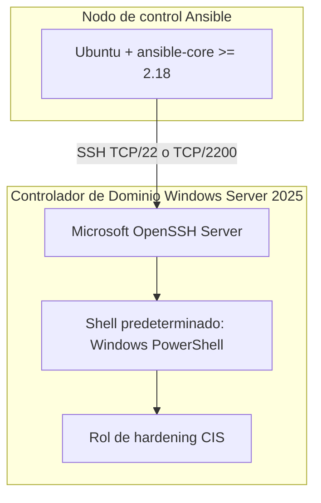
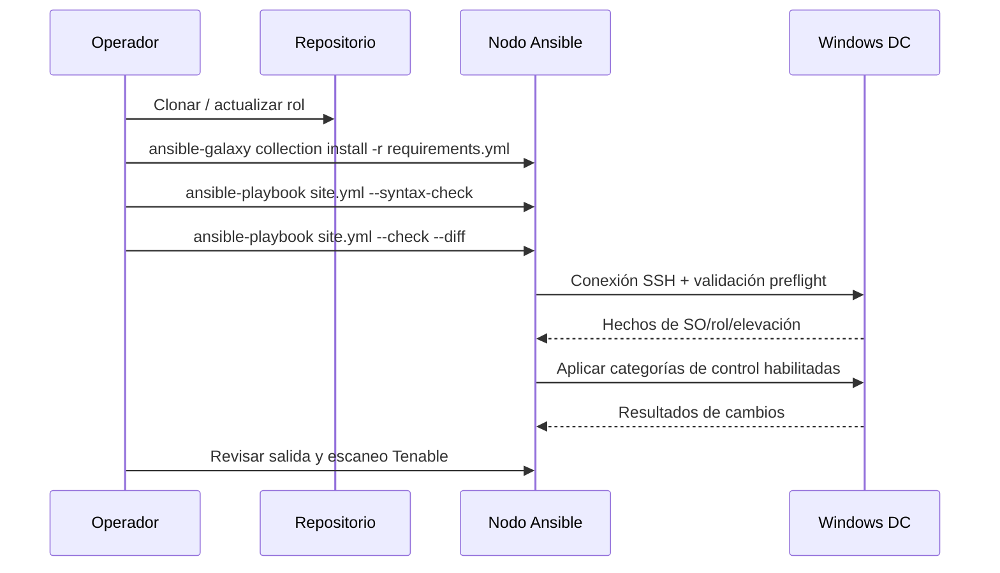

# CIS Microsoft Windows Server 2025 v2.1.0 L1 DC — Documentación de Arquitectura

*[Read in English](ARCHITECTURE.md)*

## 1. Visión general del proyecto

Este repositorio contiene una solución de *hardening* basada en Ansible para **Controladores de Dominio** con **Microsoft Windows Server 2025**, alineada con el benchmark **CIS Microsoft Windows Server 2025 v2.1.0 Nivel 1 (DC)**.

La solución fue generada a partir del archivo oficial de auditoría Tenable/CIS `CIS_Microsoft_Windows_Server_2025_v2.1.0_L1_DC (1).audit` e implementa los controles que pueden automatizarse de forma segura mediante infraestructura como código. Tras aplicar este rol y resolver los elementos marcados para revisión manual, el entorno alcanzó un **68.81% de cumplimiento** medido con un escaneo de **Tenable**.

> **Nota de alcance:** Este repositorio forma parte de un espacio de trabajo de cumplimiento más amplio. Las carpetas hermanas `CIS-WindowsServer2025` (*hardening* de servidor miembro independiente) y `PCI-DSS-COMPLIANCE-AUTOMATION-` (automatización de evidencias PCI DSS) son iniciativas separadas pero complementarias.

---

## 2. Arquitectura de despliegue



| Componente | Propósito |
|------------|-----------|
| **Nodo de control Ansible** | Servidor Ubuntu que almacena los *playbooks*, el inventario y el código del rol. Ejecuta `ansible-playbook` por SSH. |
| **Microsoft OpenSSH Server** | Demonio SSH en el DC; reemplaza a WinRM/PSRP como transporte de Ansible. |
| **Windows PowerShell** | Shell predeterminado de OpenSSH para que los módulos de Ansible se ejecuten en el runtime correcto. |
| **Destino DC** | Controlador de Dominio Windows Server 2025 existente. El rol valida esto antes de aplicar cambios. |

### ¿Por qué SSH en lugar de WinRM?

El proyecto utiliza deliberadamente `ansible_connection=ssh` porque:

* Reduce la complejidad de firewall y puertos en entornos donde WinRM/HTTP(S) está restringido.
* OpenSSH es un componente de primera clase en Windows Server.
* Los módulos `ansible.windows` y `community.windows` funcionan de forma transparente por SSH siempre que el shell predeterminado sea PowerShell.

---

## 3. Descripción archivo por archivo

### Archivos de orquestación en la raíz

| Archivo | Descripción |
|---------|-------------|
| **[site.yml](site.yml)** | *Playbook* principal. Apunta al grupo de inventario `windows_2025_dc` e incluye el rol `cis_windows_server_2025_l1_dc`. `serial: 1` asegura que los DC se endurezcan uno a la vez. |
| **[ansible.cfg](ansible.cfg)** | Configuración de ejecución de Ansible: ruta del inventario, ruta de roles, *pipelining* SSH, caché de hechos, tiempos de espera de conexión y `strategy = free` para ejecución paralela de tareas dentro de un solo host. |
| **[requirements.yml](requirements.yml)** | Declara las colecciones de Ansible requeridas: `ansible.windows` y `community.windows`. |
| **[inventory/hosts.ini](inventory/hosts.ini)** | Inventario estático que define el host DC, puerto SSH, usuario, tipo de shell y credenciales. |
| **[group_vars/windows_2025_dc.yml](group_vars/windows_2025_dc.yml)** | Sobrescritas de variables específicas del sitio. Los controles de alto impacto (`cis_apply_domain_account_policy`, `cis_apply_user_rights`, `cis_apply_account_renames`, `cis_apply_logon_banner`) están deshabilitados hasta que el operador los habilite explícitamente. |
| **[control_manifest.yml](control_manifest.yml)** | Lista los controles que el generador **no** automatizó intencionalmente porque son condicionales, multi-valor, de contexto de usuario (HKU) o requieren revisión organizacional. |
| **[GENERATION_SUMMARY.json](GENERATION_SUMMARY.json)** | Resumen legible por máquina de la ejecución de generación: total de ítems personalizados, configuraciones de registro automatizadas, eliminaciones, subcategorías de auditoría, derechos de usuario, etc. |
| **[README.md](README.md)** | Guía de inicio rápido para el usuario final: requisitos, comandos de validación y advertencias de seguridad. |

### Bootstrap

| Archivo | Descripción |
|---------|-------------|
| **[bootstrap/configure_openssh_for_ansible.ps1](bootstrap/configure_openssh_for_ansible.ps1)** | Script de PowerShell de ejecución única, lanzado localmente en el DC como Administrador. Establece el valor de registro `DefaultShell` de OpenSSH en `powershell.exe` y reinicia el servicio `sshd`. |

### Rol: `cis_windows_server_2025_l1_dc`

Ubicado en [roles/cis_windows_server_2025_l1_dc/](roles/cis_windows_server_2025_l1_dc/).

#### `defaults/main.yml`

Archivo central de variables generado a partir del archivo `.audit` proporcionado. Contiene:

* Banderas `cis_apply_*` para habilitar/deshabilitar cada categoría de hardening.
* Valores predeterminados de la política de contraseñas/bloqueo del dominio.
* Marcadores de posición para el renombrado de cuentas integradas.
* Texto del banner legal de inicio de sesión.
* `cis_registry_settings` — 194 controles de registro a nivel máquina.
* `cis_registry_removals` — 3 valores de registro que deben estar ausentes.
* `cis_user_rights` — 38 controles de asignación de derechos de usuario.
* `cis_audit_subcategory_guids` — mapa de GUIDs independientes de la configuración regional para la política de auditoría.
* `cis_audit_policies` — 34 subcategorías de política de auditoría avanzada.

#### `handlers/main.yml`

Contiene un marcador intencional: **no se define ningún *handler* de reinicio incondicional**. Los reinicios de DC deben planificarse a través del proceso de gestión de cambios de la organización.

#### `tasks/main.yml`

Punto de entrada del rol. Incluye condicionalmente cada archivo de tareas según la bandera `cis_apply_*` correspondiente.

| Archivo de tareas incluido | Condición | Propósito |
|----------------------------|-----------|-----------|
| `preflight.yml` | Siempre | Valida el SO, el rol de DC, la elevación de privilegios y detecta rutas localizadas del sistema. |
| `domain_account_policy.yml` | `cis_apply_domain_account_policy` | Establece la **política de contraseñas y bloqueo predeterminada del dominio** mediante `Set-ADDefaultDomainPasswordPolicy`. |
| `registry.yml` | `cis_apply_machine_registry` | Aplica 194 configuraciones de registro HKLM. |
| `registry_removals.yml` | `cis_apply_registry_removals` | Elimina valores de registro que CIS exige que no existan. |
| `audit_policy.yml` | `cis_apply_audit_policy` | Configura 34 subcategorías de política de auditoría avanzada usando GUIDs independientes del idioma. |
| `user_rights.yml` | `cis_apply_user_rights` | Aplica la asignación de derechos de usuario con `win_user_right`. |
| `security_options.yml` | `cis_apply_security_options` | Configura opciones de seguridad adicionales como la búsqueda anónima de SID/nombres y el cierre forzoso. |
| `account_renames.yml` | `cis_apply_account_renames` | Renombra las cuentas integradas Administrador (RID 500) e Invitado (RID 501). |
| `banner.yml` | `cis_apply_logon_banner` | Configura el título y texto del aviso legal al iniciar sesión. |

#### `tasks/preflight.yml`

Realiza cuatro verificaciones antes de cualquier modificación:

1. Valida que el destino sea un Controlador de Dominio Windows y que la sesión SSH esté elevada.
2. Recoge el título del SO, versión, rol de dominio y versión de PowerShell.
3. Detecta rutas del sistema localizadas (`SystemRoot`, `Users`, `Program Files`, `ProgramData`, `TEMP`) para que el rol funcione en instalaciones de Windows en idiomas distintos al inglés.
4. Expone esas rutas como *facts* de Ansible para las tareas posteriores.

#### `tasks/domain_account_policy.yml`

* Importa el módulo `ActiveDirectory` y obtiene el dominio actual.
* Compara la configuración actual frente a la deseada de contraseñas/bloqueo.
* Llama a `Set-ADDefaultDomainPasswordPolicy` solo cuando detecta una diferencia.
* **Importante:** Esto cambia el objeto de política de dominio predeterminada efectiva, no una GPO local. Habilítelo solo después de confirmar que la organización desea estos valores a nivel de dominio.

#### `tasks/registry.yml`

Itera sobre `cis_registry_settings` y usa `ansible.windows.win_regedit` para aplicar cada valor HKLM. `throttle: 8` limita las operaciones concurrentes de registro.

#### `tasks/registry_removals.yml`

Itera sobre `cis_registry_removals` y usa `win_regedit` con `state: absent` para eliminar valores que CIS requiere que no existan.

#### `tasks/audit_policy.yml`

* Usa `auditpol /backup` para leer la configuración actual en un CSV temporal.
* Mapea subcategorías por sus GUIDs conocidos e independientes de la configuración regional (evita fallos en sistemas no ingleses).
* Calcula las máscaras de bits deseadas para éxito/fractura y llama a `auditpol /set` solo para los ítems que difieren.
* Devuelve los ítems modificados a Ansible.

#### `tasks/user_rights.yml`

Itera sobre `cis_user_rights` y llama a `ansible.windows.win_user_right` con `action: set`. **Esto reemplaza la lista completa de principios** para cada privilegio, por lo que está deshabilitado por defecto.

#### `tasks/security_options.yml`

Configura dos opciones de seguridad de acceso del sistema mediante `community.windows.win_security_policy`:

* Deshabilitar la traducción anónima de SID/Nombre.
* Forzar el cierre de sesión cuando expire el horario de inicio de sesión.

#### `tasks/account_renames.yml`

Usa `win_powershell` para localizar las cuentas integradas Administrador (SID terminado en `-500`) e Invitado (SID terminado en `-501`) y las renombra solo si el nombre actual difiere del valor deseado.

#### `tasks/banner.yml`

Escribe el título y texto del aviso legal en:

```
HKLM:\Software\Microsoft\Windows\CurrentVersion\Policies\System
```

#### `vars/localized_paths.yml`

Variables de referencia y comentarios que documentan la detección de rutas independientes del idioma realizada en `preflight.yml`. También lista rutas alternativas comunes de PowerShell y registros.

---

## 4. Flujo de ejecución



### Secuencia recomendada de despliegue

1. Instalar colecciones: `ansible-galaxy collection install -r requirements.yml`
2. Validar SSH: `ssh ansible-user@DC_IP`
3. Validar Ansible: `ansible windows_2025_dc -m ansible.windows.win_ping`
4. Verificación de sintaxis: `ansible-playbook site.yml --syntax-check`
5. Ejecución en modo simulacro: `ansible-playbook site.yml --check --diff`
6. Despliegue inicial con banderas conservadoras (política de dominio y derechos de usuario desactivados): `ansible-playbook site.yml`
7. Tras la validación operacional, habilitar derechos de usuario: `ansible-playbook site.yml -e cis_apply_user_rights=true`
8. Finalmente, habilitar la política de cuenta de dominio solo tras aprobación de GPO/AD: `ansible-playbook site.yml -e cis_apply_domain_account_policy=true`

---

## 5. Alcance de cumplimiento y resultados de Tenable

### Cobertura del benchmark

El rol fue generado a partir de un archivo `.audit` de Tenable con **325 ítems personalizados**:

| Categoría | Cantidad | Estado de automatización |
|-----------|---------:|--------------------------|
| Configuraciones de registro a nivel máquina automatizadas | 194 | Automatizado vía `registry.yml` |
| Valores de registro que deben estar ausentes | 3 | Automatizado vía `registry_removals.yml` |
| Subcategorías de política de auditoría avanzada | 34 | Automatizado vía `audit_policy.yml` |
| Controles de asignación de derechos de usuario | 38 | Automatizado, deshabilitado por defecto |
| Controles de política de contraseñas | 7 | Automatizado cuando se habilita la política de dominio |
| Controles de política de bloqueo | 3 | Automatizado cuando se habilita la política de dominio |
| Controles de registro de contexto de usuario (HKU) | 7 | Reservados para revisión manual/GPO |
| Controles de registro complejos/condicionales | 18 | Reservados para revisión manual |

### Resultado del escaneo Tenable

Tras aplicar la porción automatizada del rol y documentar los ítems de revisión en [control_manifest.yml](control_manifest.yml), el entorno alcanzó una puntuación de cumplimiento del **68.81%** en el escaneo de Tenable.

> La brecha restante corresponde a:
> * Controles reservados para revisión en `control_manifest.yml`.
> * Configuraciones de alto impacto intencionalmente deshabilitadas por defecto (`user_rights`, `domain_account_policy`, `account_renames`, `logon_banner`).
> * Controles dependientes de la organización/GPO que no pueden automatizarse de forma segura sin aprobación del negocio.

Para aumentar la puntuación, habilite las categorías deshabilitadas tras validarlas y resuelva los ítems listados en `control_manifest.yml` a través de su proceso de cambios aprobado.

---

## 6. Consideraciones de seguridad y seguridad operacional

* **Los Controladores de Dominio son sistemas de alto impacto:** el rol deshabilita por defecto los controles más disruptivos.
* **Sin reinicio automático:** el rol nunca reinicia un DC. Planifique los reinicios por separado.
* **User Rights reemplaza la lista completa de principios:** habilitar `cis_apply_user_rights=true` puede afectar aplicaciones, agentes de respaldo, herramientas de monitoreo o identidades de servicio que dependen de privilegios adicionales.
* **La política de cuenta de dominio afecta a todo el dominio:** habilitar `cis_apply_domain_account_policy=true` cambia la política de contraseñas/bloqueo predeterminada efectiva para todos los usuarios del dominio.
* **El renombrado de cuentas y los banners** son opcionales y pueden requerir coordinación con los equipos operacionales.
* **Rutas localizadas:** el *preflight* detecta rutas específicas del idioma (p. ej., `C:\Usuarios` vs `C:\Users`), haciendo el rol compatible con instalaciones de Windows Server en idiomas distintos al inglés.
* **Protección de credenciales:** el inventario actual almacena una contraseña en texto plano. Para producción, migre a autenticación por clave SSH y elimine `ansible_ssh_pass` del inventario.

---

## 7. Integración con el espacio de trabajo más amplio

| Repositorio | Relación |
|-------------|----------|
| `PCI-DSS-COMPLIANCE-AUTOMATION-` | Genera evidencias PCI DSS diarias, semanales, mensuales y trimestrales a partir de FortiGate, Check Point y Wazuh. |
| `CIS-WindowsServer2025` | Rol de hardening L1 para servidor miembro Windows Server 2025 independiente (no DC). |
| `CIS-WindowsServer2025DC` (este repositorio) | Rol de hardening L1 específico para Controladores de Dominio Windows Server 2025. |

En conjunto, estos proyectos soportan la postura de seguridad de la organización: el proyecto PCI-DSS produce evidencias de cumplimiento, mientras que los proyectos CIS endurecen la infraestructura subyacente de Windows Server.
