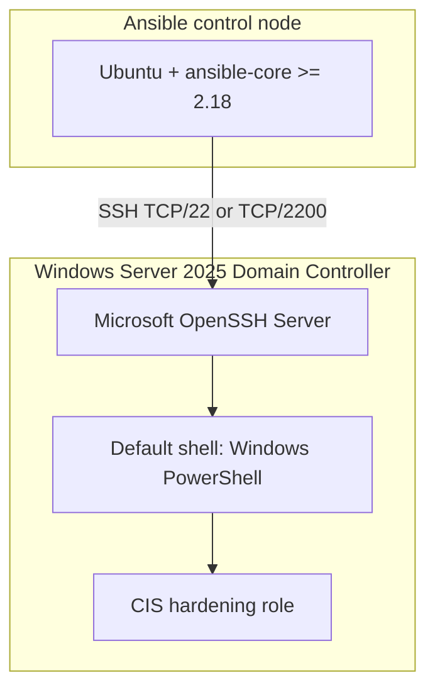
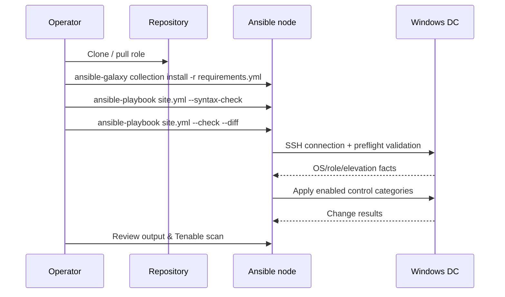

# CIS Microsoft Windows Server 2025 v2.1.0 L1 DC — Architecture Documentation

*[Leer en español](ARCHITECTURE.es.md)*

## 1. Project overview

This repository contains an Ansible-based hardening solution for **Domain Controllers** running **Microsoft Windows Server 2025**, aligned with the **CIS Microsoft Windows Server 2025 v2.1.0 Level 1 (DC)** benchmark.

The solution was generated from the official Tenable/CIS audit file `CIS_Microsoft_Windows_Server_2025_v2.1.0_L1_DC (1).audit` and implements the controls that can be safely automated through infrastructure-as-code. After applying this role and resolving the items flagged for manual review, the environment reached a **68.81% compliance score** as measured by a **Tenable** vulnerability/compliance scan.

> **Scope note:** This repository is part of a larger compliance workspace. The sibling folders `CIS-WindowsServer2025` (stand-alone member server hardening) and `PCI-DSS-COMPLIANCE-AUTOMATION-` (PCI DSS evidence automation) are separate but complementary initiatives.

---

## 2. Deployment architecture



| Component | Purpose |
|-----------|---------|
| **Ansible control node** | Ubuntu server that stores the playbooks, inventory, and role code. Runs `ansible-playbook` over SSH. |
| **Microsoft OpenSSH Server** | SSH daemon on the DC; replaces WinRM/PSRP as the Ansible transport. |
| **Windows PowerShell** | Default OpenSSH shell so Ansible modules execute in the correct runtime. |
| **DC target** | Existing Windows Server 2025 Domain Controller. The role validates this before applying changes. |

### Why SSH instead of WinRM?

The project deliberately uses `ansible_connection=ssh` because:

* It reduces firewall and port complexity in environments where WinRM/HTTP(S) is restricted.
* OpenSSH is a first-class Windows Server component.
* The `ansible.windows` and `community.windows` modules work transparently over SSH as long as the default shell is PowerShell.

---

## 3. File-by-file description

### Root-level orchestration files

| File | Description |
|------|-------------|
| **[site.yml](site.yml)** | Main playbook. Targets the `windows_2025_dc` inventory group and includes the `cis_windows_server_2025_l1_dc` role. `serial: 1` ensures DCs are hardened one at a time. |
| **[ansible.cfg](ansible.cfg)** | Ansible runtime configuration: inventory path, roles path, SSH pipelining, fact caching, connection timeouts, and `strategy = free` for parallel task execution inside a single host. |
| **[requirements.yml](requirements.yml)** | Declares the required Ansible collections: `ansible.windows` and `community.windows`. |
| **[inventory/hosts.ini](inventory/hosts.ini)** | Static inventory defining the DC host, SSH port, user, shell type, and credentials. |
| **[group_vars/windows_2025_dc.yml](group_vars/windows_2025_dc.yml)** | Site-specific variable overrides. High-impact controls (`cis_apply_domain_account_policy`, `cis_apply_user_rights`, `cis_apply_account_renames`, `cis_apply_logon_banner`) are disabled until the operator explicitly enables them. |
| **[control_manifest.yml](control_manifest.yml)** | Lists the controls that the generator intentionally did **not** automate because they are conditional, multi-valued, user-context (HKU), or require organizational review. |
| **[GENERATION_SUMMARY.json](GENERATION_SUMMARY.json)** | Machine-readable summary of the generation run: total custom items, automated registry settings, removals, audit subcategories, user rights, etc. |
| **[README.md](README.md)** | End-user quick-start guide: requirements, validation commands, and safety warnings. |
| **[ARCHITECTURE.md](ARCHITECTURE.md)** | This file. Complete architecture, file-by-file reference, operational runbook, and integration notes. |

### Bootstrap

| File | Description |
|------|-------------|
| **[bootstrap/configure_openssh_for_ansible.ps1](bootstrap/configure_openssh_for_ansible.ps1)** | One-time PowerShell script run locally on the DC as Administrator. Sets the OpenSSH `DefaultShell` registry value to `powershell.exe` and restarts the `sshd` service. |

### Role: `cis_windows_server_2025_l1_dc`

Located under [roles/cis_windows_server_2025_l1_dc/](roles/cis_windows_server_2025_l1_dc/).

#### `defaults/main.yml`

Central variable file generated from the supplied `.audit` file. It contains:

* `cis_apply_*` feature flags to enable/disable each hardening category.
* Default values for domain password/lockout policy.
* Built-in account rename placeholders.
* Legal notice banner text.
* `cis_registry_settings` — 194 machine-level registry controls.
* `cis_registry_removals` — 3 registry values that must be absent.
* `cis_user_rights` — 38 user rights assignment controls.
* `cis_audit_subcategory_guids` — locale-independent GUID map for audit policy.
* `cis_audit_policies` — 34 advanced audit policy subcategories.

#### `handlers/main.yml`

Contains a deliberate placeholder: **no unconditional reboot handler** is defined. DC reboots must be planned through the organization's change-management process.

#### `tasks/main.yml`

Role entry point. It conditionally includes each task file based on the matching `cis_apply_*` flag.

| Included task file | Condition | Purpose |
|--------------------|-----------|---------|
| `preflight.yml` | Always | Validates OS, DC role, admin elevation, and detects localized system paths. |
| `domain_account_policy.yml` | `cis_apply_domain_account_policy` | Sets the **default domain password and lockout policy** via `Set-ADDefaultDomainPasswordPolicy`. |
| `registry.yml` | `cis_apply_machine_registry` | Applies 194 HKLM registry settings. |
| `registry_removals.yml` | `cis_apply_registry_removals` | Removes registry values required to be absent. |
| `audit_policy.yml` | `cis_apply_audit_policy` | Configures 34 Advanced Audit Policy subcategories using locale-independent GUIDs. |
| `user_rights.yml` | `cis_apply_user_rights` | Applies User Rights Assignment with `win_user_right`. |
| `security_options.yml` | `cis_apply_security_options` | Sets additional security options such as LSA anonymous name lookup and force logoff. |
| `account_renames.yml` | `cis_apply_account_renames` | Renames built-in Administrator (RID 500) and Guest (RID 501) accounts. |
| `banner.yml` | `cis_apply_logon_banner` | Configures the legal notice caption and text at logon. |

#### `tasks/preflight.yml`

Performs four checks before any modification:

1. Validates that the target is a Windows Domain Controller and that the SSH session is elevated.
2. Collects OS caption, version, domain role, and PowerShell version.
3. Detects localized system paths (`SystemRoot`, `Users`, `Program Files`, `ProgramData`, `TEMP`) so the role works on non-English Windows installs.
4. Exposes those paths as Ansible facts for downstream tasks.

#### `tasks/domain_account_policy.yml`

* Imports the `ActiveDirectory` module and obtains the current domain.
* Compares current vs. desired password/lockout settings.
* Calls `Set-ADDefaultDomainPasswordPolicy` only when a drift is detected.
* **Important:** This changes the effective default domain policy object, not a local GPO. Enable only after confirming the organization wants these values at domain level.

#### `tasks/registry.yml`

Loops over `cis_registry_settings` and uses `ansible.windows.win_regedit` to apply each HKLM value. `throttle: 8` limits concurrent registry operations.

#### `tasks/registry_removals.yml`

Loops over `cis_registry_removals` and uses `win_regedit` with `state: absent` to delete values that CIS requires not to exist.

#### `tasks/audit_policy.yml`

* Uses `auditpol /backup` to read current settings into a temporary CSV.
* Maps subcategories by their well-known, locale-independent GUIDs (avoids failures on non-English systems).
* Computes desired success/failure bitmasks and calls `auditpol /set` only for items that drift.
* Reports changed items back to Ansible.

#### `tasks/user_rights.yml`

Loops over `cis_user_rights` and calls `ansible.windows.win_user_right` with `action: set`. **This replaces the complete principal list** for each privilege, which is why it is disabled by default.

#### `tasks/security_options.yml`

Configures two system-access security options via `community.windows.win_security_policy`:

* Disable anonymous SID/Name translation.
* Force logoff when logon hours expire.

#### `tasks/account_renames.yml`

Uses `win_powershell` to locate the built-in Administrator (SID ending in `-500`) and Guest (SID ending in `-501`) accounts and renames them only if the current name differs from the desired value.

#### `tasks/banner.yml`

Writes the legal notice caption and text to:

```
HKLM:\Software\Microsoft\Windows\CurrentVersion\Policies\System
```

#### `vars/localized_paths.yml`

Reference variables and comments documenting the language-agnostic path detection performed in `preflight.yml`. It also lists hard-coded fallbacks for common PowerShell and log paths.

---

## 4. Execution flow



### Recommended deployment sequence

1. Install collections: `ansible-galaxy collection install -r requirements.yml`
2. Validate SSH: `ssh ansible-user@DC_IP`
3. Validate Ansible: `ansible windows_2025_dc -m ansible.windows.win_ping`
4. Syntax check: `ansible-playbook site.yml --syntax-check`
5. Dry run: `ansible-playbook site.yml --check --diff`
6. Initial deploy with conservative flags (domain policy and user rights off): `ansible-playbook site.yml`
7. After operational validation, enable user rights: `ansible-playbook site.yml -e cis_apply_user_rights=true`
8. Finally, enable domain account policy only after GPO/AD approval: `ansible-playbook site.yml -e cis_apply_domain_account_policy=true`

---

## 5. Compliance scope and Tenable results

### Benchmark coverage

The role was generated from a Tenable `.audit` file containing **325 custom items**:

| Category | Count | Automation status |
|----------|------:|-------------------|
| Machine registry settings automated | 194 | Automated via `registry.yml` |
| Registry values required absent | 3 | Automated via `registry_removals.yml` |
| Advanced Audit Policy subcategories | 34 | Automated via `audit_policy.yml` |
| User Rights Assignment controls | 38 | Automated, disabled by default |
| Password policy checks | 7 | Automated when domain policy enabled |
| Lockout policy checks | 3 | Automated when domain policy enabled |
| User-context registry controls (HKU) | 7 | Held for manual/GPO review |
| Complex/conditional registry checks | 18 | Held for manual review |

### Tenable scan result

After applying the automated portion of the role and documenting the review items in [control_manifest.yml](control_manifest.yml), the environment achieved a compliance score of **68.81%** in the Tenable scan.

> The remaining gap corresponds to:
> * Controls held for review in `control_manifest.yml`.
> * High-impact settings intentionally disabled by default (`user_rights`, `domain_account_policy`, `account_renames`, `logon_banner`).
> * Organizational/GPO-dependent controls that cannot be safely automated without business approval.

To increase the score, enable the disabled categories after validation and resolve the items listed in `control_manifest.yml` through your approved change process.

---

## 6. Configuration and tuning

### Feature flags

All hardening categories are gated by `cis_apply_*` flags. The current site overrides in [group_vars/windows_2025_dc.yml](group_vars/windows_2025_dc.yml) keep high-impact controls disabled until they are validated:

```yaml
cis_apply_domain_account_policy: false
cis_apply_user_rights: false
cis_apply_account_renames: false
cis_apply_logon_banner: false

cis_apply_machine_registry: true
cis_apply_registry_removals: true
cis_apply_audit_policy: true
cis_apply_security_options: true
```

### Tunable values

Default values are defined in [roles/cis_windows_server_2025_l1_dc/defaults/main.yml](roles/cis_windows_server_2025_l1_dc/defaults/main.yml). The most commonly reviewed are:

| Variable | Default | Notes |
|----------|---------|-------|
| `cis_administrator_account_name` | `CIS-Administrator-CHANGE-ME` | Must be changed before enabling `cis_apply_account_renames`. |
| `cis_guest_account_name` | `CIS-Guest-CHANGE-ME` | Must be changed before enabling `cis_apply_account_renames`. |
| `cis_legal_notice_caption` | `Authorized Use Only` | Customize to match organizational policy. |
| `cis_legal_notice_text` | *see defaults* | Customize to match organizational policy. |
| `cis_domain_password_history` | `24` | CIS required minimum. |
| `cis_domain_max_password_age_days` | `365` | Maximum password lifetime. |
| `cis_domain_min_password_age_days` | `1` | Prevents rapid password cycling. |
| `cis_domain_min_password_length` | `14` | CIS required minimum. |
| `cis_domain_complexity_enabled` | `true` | Enables password complexity. |
| `cis_domain_reversible_encryption_enabled` | `false` | Must remain disabled per CIS. |
| `cis_domain_lockout_duration_minutes` | `15` | Lockout duration. |
| `cis_domain_lockout_threshold` | `5` | Failed attempts before lockout. |
| `cis_domain_lockout_observation_window_minutes` | `15` | Observation window for threshold. |

### Inventory and credentials

The current [inventory/hosts.ini](inventory/hosts.ini) uses a plaintext password. For production, replace `ansible_ssh_pass` with SSH key authentication:

```ini
[windows_2025_dc:vars]
ansible_connection=ssh
ansible_shell_type=powershell
ansible_shell_executable=powershell.exe
ansible_ssh_private_key_file=~/.ssh/id_ed25519_cis_dc
```

## 7. Security and safety considerations

* **Domain Controllers are high-impact:** The role disables the most disruptive controls by default.
* **No automatic reboot:** The role never reboots a DC. Plan restarts separately.
* **User Rights replace the entire principal list:** Enabling `cis_apply_user_rights=true` can break applications, backup agents, monitoring tools, or service identities that rely on additional privileges.
* **Domain account policy affects the whole domain:** Enabling `cis_apply_domain_account_policy=true` changes the effective default domain password/lockout policy for all domain users.
* **Account renames and banners** are optional and may require coordination with operational teams.
* **Localized paths:** The preflight detects language-specific paths (e.g., `C:\Usuarios` vs `C:\Users`), making the role compatible with non-English Windows Server installs.
* **Credential protection:** The current inventory stores a password in plaintext. For production, migrate to SSH key authentication and remove `ansible_ssh_pass` from the inventory.

---

## 8. Operational runbook

### Before the first run

1. **Review the inventory.** Confirm the DC hostname/IP, SSH port, and authentication method in [inventory/hosts.ini](inventory/hosts.ini).
2. **Review `group_vars`.** Make sure only the categories you want to apply are enabled in [group_vars/windows_2025_dc.yml](group_vars/windows_2025_dc.yml).
3. **Customize defaults.** Change placeholder account names, banner text, and password/lockout values in [roles/cis_windows_server_2025_l1_dc/defaults/main.yml](roles/cis_windows_server_2025_l1_dc/defaults/main.yml).
4. **Resolve `control_manifest.yml` items.** Decide how your organization will address the 7 user-context and 18 complex/conditional controls.
5. **Snapshot/back up the DC.** Take a VM snapshot or system-state backup before applying changes.
6. **Schedule a maintenance window.** Although the role does not reboot automatically, some changes may require a restart to become fully effective.

### During the run

* Watch the preflight output to confirm OS version, domain role, elevation, and localized paths.
* Review the `--diff` output to see exactly which registry values, audit policies, and security options change.
* If running in `--check`, note that some Windows modules cannot fully simulate changes.

### After the run

1. Verify services and applications still function correctly.
2. Run a new Tenable compliance scan to measure the updated score.
3. Address any remaining gaps by enabling additional flags or resolving `control_manifest.yml` items.
4. Document any deviations or exceptions for auditors.

### Rollback

Because the role uses Ansible modules that enforce state, you can revert most changes by:

* Restoring from a VM snapshot or system-state backup for major issues.
* Setting the relevant `cis_apply_*` flag to `false` and re-running the playbook. This removes only values managed by idempotent modules (`win_regedit` with `state: absent`, etc.); it does **not** automatically revert every CIS control to its previous value.
* For domain password policy, manually set the desired values with `Set-ADDefaultDomainPasswordPolicy` or through the Default Domain Policy GPO.

> **Important:** Always test rollback steps in a lab environment before relying on them in production.

## 9. Integration with the broader workspace

| Repository | Relationship |
|------------|--------------|
| `PCI-DSS-COMPLIANCE-AUTOMATION-` | Generates daily/weekly/monthly/quarterly PCI DSS evidence from FortiGate, Check Point, and Wazuh. |
| `CIS-WindowsServer2025` | Stand-alone (non-DC) Windows Server 2025 L1 hardening role. |
| `CIS-WindowsServer2025DC` (this repo) | Domain Controller-specific Windows Server 2025 L1 hardening role. |

Together, these projects support the organization's security posture: the PCI-DSS project produces compliance evidence, while the CIS projects harden the underlying Windows Server infrastructure.

---

## 10. Summary

This project delivers an infrastructure-as-code implementation of the **CIS Microsoft Windows Server 2025 v2.1.0 L1 Domain Controller** benchmark using Ansible over SSH. It automates 194 machine registry settings, 34 advanced audit policies, 38 user rights assignments, domain password/lockout policies, and optional account renames/logon banners, while intentionally leaving 25 complex or user-context controls in [control_manifest.yml](control_manifest.yml) for organizational review.

After applying the automated controls, the environment achieved **68.81% compliance** on a Tenable scan. The remaining gap can be closed by enabling the high-impact flags after validation and resolving the review items through the approved change process.
